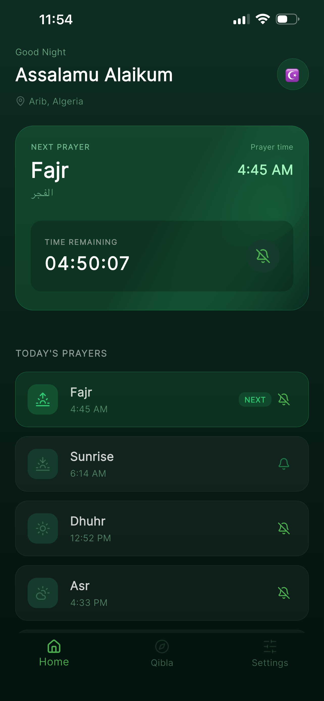
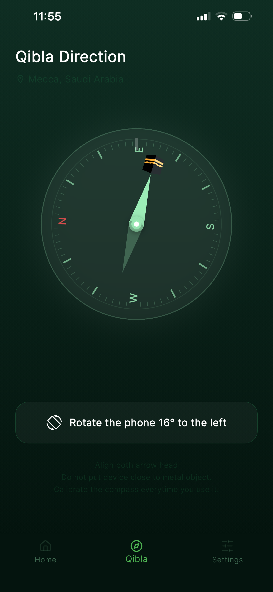
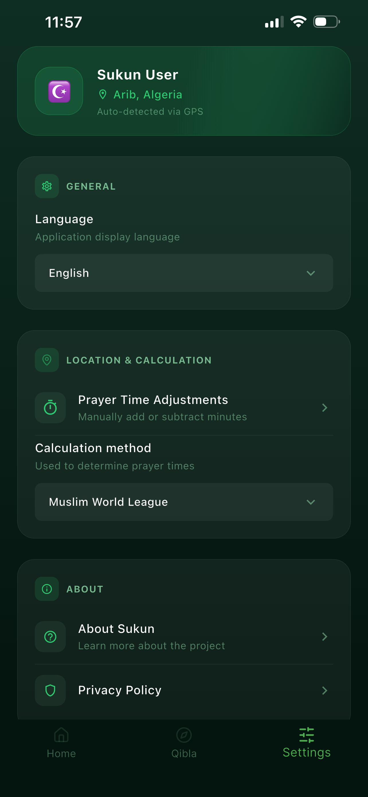
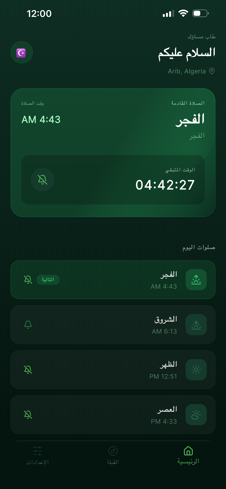
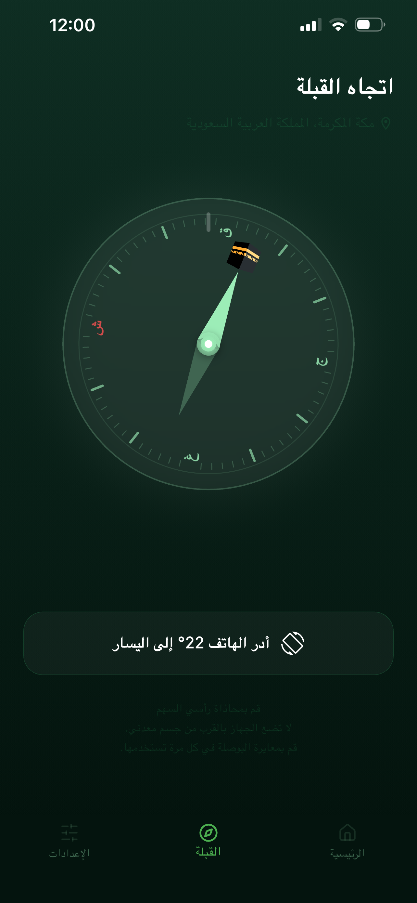
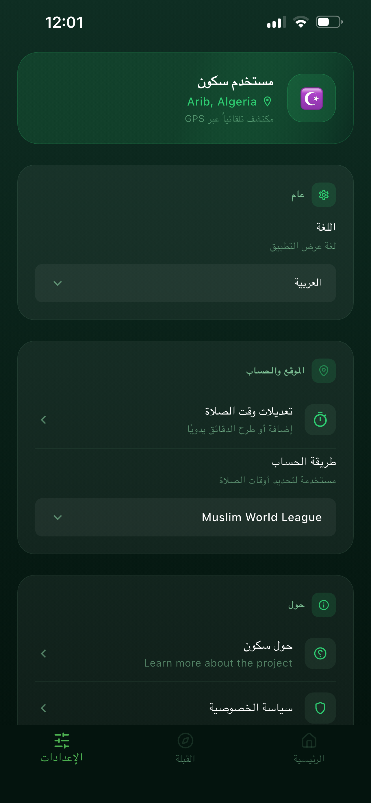

# 🌙 Sukun

[](https://opensource.org/licenses/MIT)
[](https://flutter.dev)

**Sukun** is a premium, open-source Flutter application designed to help Muslims automatically manage their device's sound mode during prayer times. It ensures that your phone honors every prayer by silencing it when you are in the mosque and restoring your preferences afterward.

---

## ✨ Key Features

- **🚀 Automatic Silent Mode**: detects local prayer times and silences your phone automatically.
- **📍 Smart Location Detection**: Uses GPS to detect your city and calculate precise prayer times locally.
- **🧭 Qibla Compass**: A beautiful and accurate compass to find the direction of the Kaaba from anywhere.
- **⚙️ Deep Customization**: 
  - Choose which prayers to silence.
  - Set custom durations (minutes before and after prayer).
  - Special handling for Jumu'ah (Friday) and Tarawih prayers.
- **🛡️ Privacy First**: All location and calculation data stay on your device. Nothing is uploaded to any server.
- **🌍 Multi-Language Support**: Fully localized in Arabic and English.
- **📦 Reliable Background Execution**: Uses WorkManager and Precise Alarms to ensure reliability even when the app is closed.

---

## 📸 Screenshots


    |  |  
   |  |  

---
## 🏗 Architecture

The project follows a **Feature-Driven Clean Architecture** to ensure scalability, testability, and maintainability.

### The Three-Layer Rule:
1. **Data Layer (`/data`)**: Handles models, API/Local datasources, and repository implementations.
2. **Domain Layer (`/domain`)**: Contains pure business logic, entities, and use cases.
3. **Presentation Layer (`/presentation`)**: Manages UI state using the **Cubit** pattern and Atomic UI components.

---

## 🛠 Tech Stack

- **Framework**: [Flutter](https://flutter.dev)
- **State Management**: [Flutter Bloc (Cubit)](https://pub.dev/packages/flutter_bloc)
- **Dependency Injection**: [GetIt](https://pub.dev/packages/get_it)
- **Local Database**: [Sqflite](https://pub.dev/packages/sqflite)
- **Prayer Logic**: [Adhan Dart](https://pub.dev/packages/adhan_dart)
- **Background Tasks**: [WorkManager](https://pub.dev/packages/workmanager) & [Android Alarm Manager Plus](https://pub.dev/packages/android_alarm_manager_plus)

---

## 🚀 Getting Started

### Prerequisites
- Flutter SDK (latest version recommended)
- Android Studio / VS Code
- A physical device (recommended for testing background services)

### Installation

1. Clone the repository:
   ```bash
   git clone https://github.com/mohammedzizou/sukun.git
   ```
2. Install dependencies:
   ```bash
   flutter pub get
   ```
3. Run the application:
   ```bash
   flutter run
   ```

---

## 📄 License & Privacy

- **License**: Distributed under the **MIT License**. See [LICENSE](LICENSE) for more information.
- **Privacy Policy**: We take your privacy seriously. Read our [Privacy Policy](PRIVACY_POLICY.md).

---

## 🤝 Contributing

Contributions are what make the open-source community such an amazing place to learn, inspire, and create. Any contributions you make are **greatly appreciated**.

1. Fork the Project
2. Create your Feature Branch (`git checkout -b feature/AmazingFeature`)
3. Commit your Changes (`git commit -m 'Add some AmazingFeature'`)
4. Push to the Branch (`git push origin feature/AmazingFeature`)
5. Open a Pull Request

---

## 📩 Contact

**Mohammed Zizou** - [GitHub](https://github.com/mohammedzizou)

Project Link: [https://github.com/mohammedzizou/sukun](https://github.com/mohammedzizou/sukun)

---
*Made with ☪ for the Ummah.*
